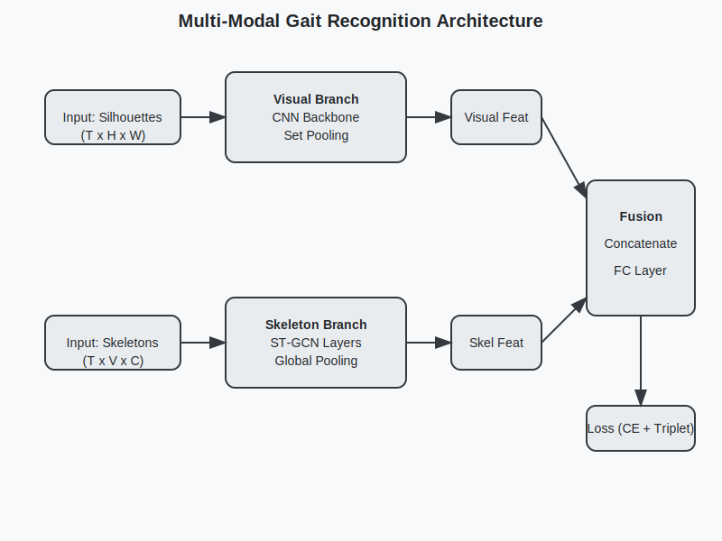

# Multi-Modal Gait Recognition (Visual + Skeleton)

本项目实现了一个基于 CASIA-B 数据集的双流步态识别模型。该模型结合了视觉特征（使用类 GaitSet 结构）和骨架特征（使用 ST-GCN），以提高识别的鲁棒性。骨架数据使用 YOLOv11 进行提取。

## 项目结构

```
gaintRec/
├── config/
│   └── config.yaml         # 训练配置文件
├── data/
│   ├── CASIA-B/            # (需自行下载) 原始数据集
│   └── skeletons/          # (自动生成) 提取的骨架数据
├── src/
│   ├── model/              # 模型定义
│   │   ├── visual.py       # 视觉分支 (CNN + Set Pooling)
│   │   ├── skeleton.py     # 骨架分支 (ST-GCN)
│   │   └── fusion.py       # 融合模型
│   ├── dataset.py          # 数据加载器
│   ├── extract_skeletons.py # 骨架提取脚本
│   └── train.py            # 训练脚本
├── checkpoints/            # 模型权重保存路径
├── model_structure.svg     # 模型结构图
└── README.md               # 项目说明
```

## 环境依赖

请确保安装以下 Python 库：

```bash
pip install torch torchvision numpy opencv-python pyyaml ultralytics tqdm
```

## 使用方法

### 1. 数据准备

1.  下载 CASIA-B 数据集，并解压到 `data/CASIA-B`。
2.  使用 YOLOv11 提取骨架数据：

```bash
python src/extract_skeletons.py --data_root data/CASIA-B --output_root data/skeletons
```

### 2. 训练模型

修改 `config/config.yaml` 中的参数（如路径、Batch Size 等），然后运行：

```bash
python src/train.py --config config/config.yaml
```

### 3. 模型架构

模型由两个分支组成：
*   **视觉分支**: 输入轮廓图序列，经过 CNN 提取帧特征，再通过 Set Pooling 聚合为视频级特征。
*   **骨架分支**: 输入骨架关键点序列 (17 keypoints)，通过 ST-GCN 提取时空特征。
*   **融合模块**: 将两个分支的特征拼接，通过全连接层映射到 Embedding 空间，使用 Cross Entropy Loss 和 Triplet Loss 进行训练。


