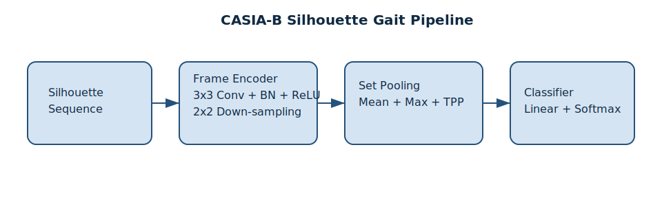

# CASIA-B Silhouette Gait Recognition

基于 CASIA-B 轮廓数据集的步态识别示例项目，参考 GaitSet 等常见 silhouette-based 方法：先对单帧轮廓序列做卷积编码，再通过集合池化(Mean/Max + Temporal Pyramid Pooling)获得时序无关的表示，最终完成身份分类。

## 数据集结构
```
data/GaitDatasetB-silh/
  ├── 001/                     # 被试编号(001-124)
  │   ├── nm-01/               # 行走状态：正常(nm,01-06)、背包(bg,01-02)、大衣(cl,01-02)
  │   │   ├── 000/             # 拍摄角度：000, 018, ..., 180
  │   │   │   ├── 001-nm-01-000-001.png
  │   │   │   └── ... (<=150帧)
  │   └── ...
  └── ...
```
默认从 `data/GaitDatasetB-silh` 自动发现 001-124 的 subject 文件夹，可通过配置文件自定义训练/验证划分。

## 项目结构
```
config/config.yaml        # 训练超参与数据配置
src/data/casia_b.py       # CASIA-B 数据集读取、划分工具
src/model/gaitset.py      # Silhouette 编码器 + Set Pooling + 分类头
src/train.py              # 训练/验证循环、日志与 checkpoint
src/inference.py          # 单样本推理脚本
src/evaluate.py           # 验证集评估脚本 (Accuracy, Recall, F1)
src/utility/unzip_dataset.py # 数据解压小工具
README.md                 # 使用说明
docs/architecture.svg     # 模型结构示意图
```

## 依赖安装
```bash
python -m venv .venv && source .venv/bin/activate  # 推荐
pip install torch torchvision torchaudio --index-url https://download.pytorch.org/whl/cu121  # 按需选择CUDA/CPU版本
pip install pyyaml pillow scikit-learn tensorboard
```
> 若需批量解压数据，可运行 `python -m src.utility.unzip_dataset --data-dir data/raw_archives`。

## 模型架构


- **Frame Encoder**：3 层 3x3 Conv+BN+ReLU + 2x2 下采样，得到每帧 128 维特征。
- **Set Pooling**：全局 Mean/Max + Temporal Pyramid Pooling(1,2,4 bin)，对任意长度序列生成固定维度表示。
- **Classifier**：Dropout + 全连接输出 124 类 softmax。

## 配置说明
`config/config.yaml` 示例：
```yaml
experiment:
  seed: 42
  output_dir: runs/casia-b-baseline

data:
  root: data/GaitDatasetB-silh
  train_ratio: 0.85
  split_seed: 7
  frames_per_clip: 30
  min_frames: 8
  sampling_strategy: uniform
  batch_size: 8
  num_workers: 4

model:
  in_channels: 1
  frame_feature_dims: [32, 64, 128]
  pyramid_bins: [1, 2, 4]
  dropout: 0.3

optim:
  lr: 0.0003
  weight_decay: 0.0001
  epochs: 50
  label_smoothing: 0.0
```
- 若提供 `data.train_subjects` / `data.val_subjects` (列表形式，如 `[1,2,3]`)，将覆盖 `train_ratio` 自动划分。
- `frames_per_clip` 控制序列截取长度(不足会重复采样，超出按均匀/随机策略抽取)。

## 训练与验证
```bash
python -m src.train --config config/config.yaml
```
日志包含每个 epoch 的 loss/acc，`runs/casia-b-baseline/` 下会保存：
- `latest.pt`：最近一次 checkpoint
- `best.pt`：验证精度最佳模型
- `history.json`：训练/验证曲线数据
- `tensorboard/`：TensorBoard 日志

### 查看 TensorBoard 日志
```bash
tensorboard --logdir runs/casia-b-baseline/tensorboard
```
然后在浏览器访问 `http://localhost:6006`。

## 推理 (Inference)
对单个包含轮廓序列的文件夹进行推理：
```bash
python -m src.inference \
  --config config/config.yaml \
  --checkpoint runs/casia-b-baseline/best.pt \
  --input_dir data/GaitDatasetB-silh/001/nm-01/090
```
脚本将输出预测的类别索引（对应 Subject ID）。

## 评估 (Evaluation)
在验证集上计算详细指标（Accuracy, Recall, F1-Score）：
```bash
python -m src.evaluate \
  --config config/config.yaml \
  --checkpoint runs/casia-b-baseline/best.pt
```
输出示例：
```text
Classification Report:
              precision    recall  f1-score   support
           0       0.95      0.90      0.92        20
           ...
    accuracy                           0.92       200
   macro avg       0.91      0.90      0.90       200
weighted avg       0.92      0.92      0.92       200

Evaluation Results:
Accuracy: 0.9200
Recall:   0.9000
F1 Score: 0.9000
```

## 调参与扩展
- 修改 `model.frame_feature_dims` 可以加深/加宽卷积骨干。
- 调整 `data.sampling_strategy` 为 `random` 以提升数据增广效果。
- 若需要额外评估脚本，可在 `src/` 中添加 `eval.py` 复用相同数据与模型模块。
